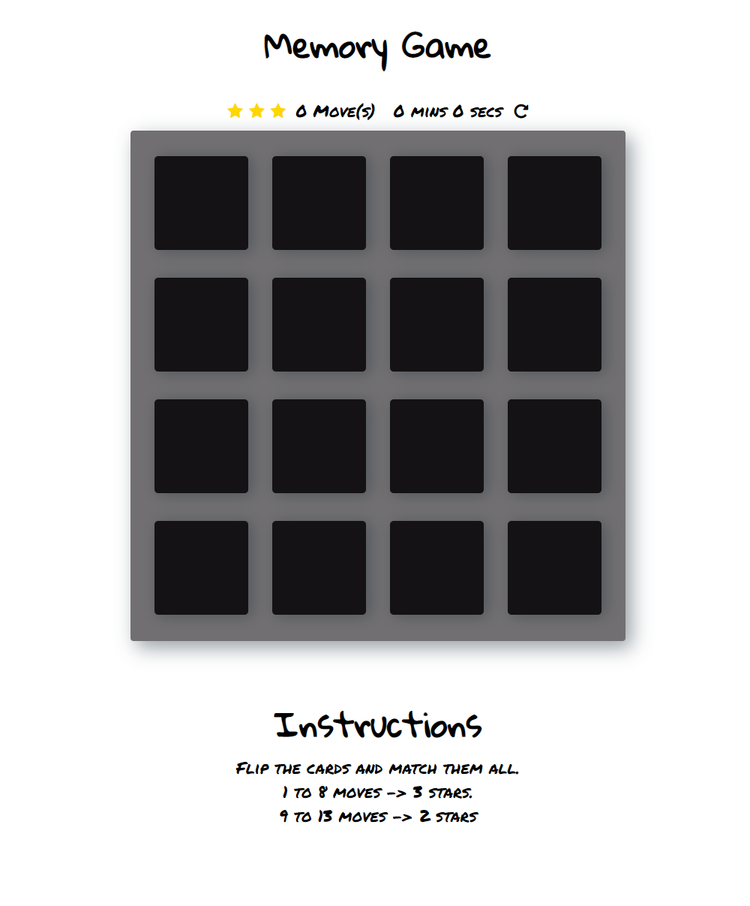

# Title: Memory Game
# Website [LINK](https://antoniobaciu.github.io/Memory-game/)

Short introduction:
__Memory Game__ as the title itself suggests, it's a memory challenging game.
The main goal of the game is to match all the squares in the shortest time possible,
and using less than __9__ moves.

# The Game Rules:
* Match all the cards
* If two choosen cards do not match they will turn back
* Finish in __8__ moves and keep __3__ stars.
* Finish between __9__  and __13__ moves and keep __2__ stars.

__Features:__
- [x] Time counter
- [x] Moves counter and rating 
- [x] Reset button
- [x] Displayed instructions
- [x] Dedicated colors and animation when there is a match or not.
- [x] Play again button 
